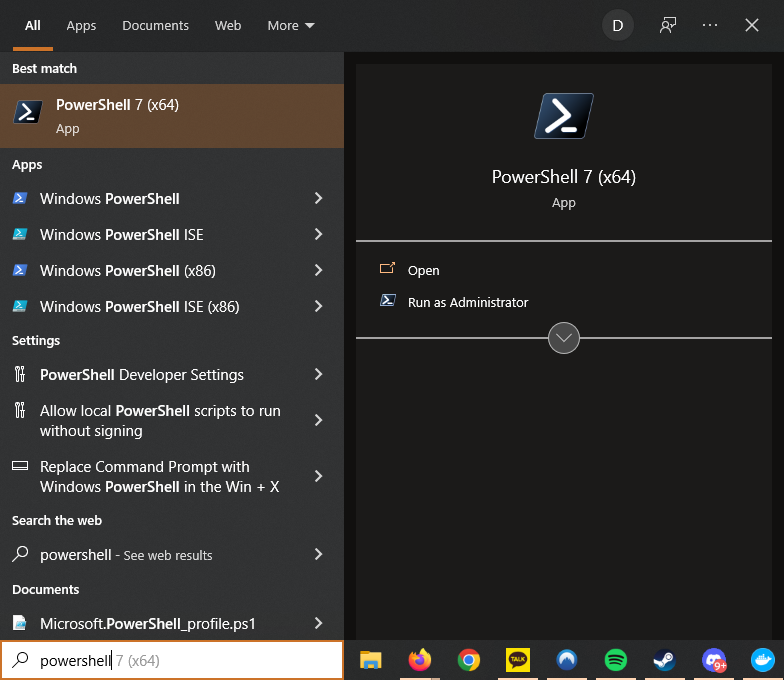
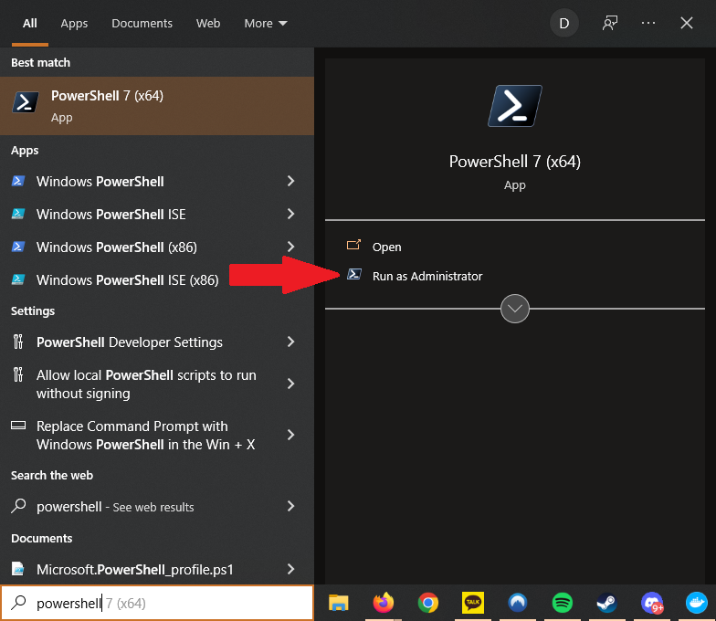

# Automated Docker Desktop Install

* [Windows](#windows)
* [Mac](#mac)
* [Linux](#linux-debian-based-ubuntu)

## Windows

You can either follow the instructions below or the [instructions from the Docker website](https://docs.docker.com/desktop/windows/install/).

1. Press the Windows key or click the start button.
2. Type `powershell`. Don't press enter!
    
3. Click "Run as administrator".
    
4. Type in `wsl --install` and press enter.
5. Close the Powershell window. This is running as Administrator, and we don't want that anymore.
6. Type `powershell`. Press enter! We want to open it for our normal user.
    
7. Copy and paste the following and press enter to download the Docker installer:
    ```powershell
   Invoke-WebRequest -Uri "https://desktop.docker.com/win/main/amd64/Docker%20Desktop%20Installer.exe" -Outfile "$HOME\Downloads\Docker Desktop Installer.exe" 
    ```
8. Copy and paste the following and press enter to install Docker Desktop:
    ```powershell
   Start-Process "$HOME\Downloads\Docker Desktop Installer.exe" -Wait install
    ```
9. You're done! You can try starting Docker Desktop like any other software.

## Mac

You can either follow the instructions below or the [instructions from the Docker website](https://docs.docker.com/desktop/mac/install/).

1. Open Spotlight either by pressing Command and spacebar or by clicking the magnifying glass in the top right of your screen.
2. Type in `Terminal` and open Terminal.
3. If you're on a new Mac with an M1 chip, copy and paste the following command into Terminal and press enter:
    ```shell
    softwareupdate --install-rosetta
    ```
4. Copy and paste the following and press enter to download the Docker for Mac installer:
    ```shell
    curl -o ~/Downloads/Docker.dmg 'https://desktop.docker.com/mac/main/amd64/Docker.dmg'
    ```
5. Copy and paste the following and press enter to install Docker for Mac. It will ask you for your password. When you type your password, nothing will appear. This is normal and for security. Type your password and press enter when prompted.
    ```shell
    sudo hdiutil attach ~/Downloads/Docker.dmg
    sudo /Volumes/Docker/Docker.app/Contents/MacOS/install
    sudo hdiutil detach /Volumes/Docker
    ```
6. You're done! Using Spotlight again, run Docker for Mac.

## Linux (Debian-based, Ubuntu)

You can either follow the instructions below or the [instructions from the Docker website](https://docs.docker.com/engine/install/ubuntu/).

We assume you're aware of Terminal. All of these commands should be run in terminal. The first `sudo` command will ask you for your password. When you type your password, nothing will appear. This is normal and for security. Type your password and press enter when prompted.

1. Copy and paste the following. It installs dependencies for Docker, securely adds the Docker repository to your recognized package repositories, and installs Docker.
    ```shell
    sudo apt-get update
    sudo apt-get install -y \
      ca-certificates \
      curl \
      gnupg \
      lsb-release
    curl -fsSL https://download.docker.com/linux/ubuntu/gpg | sudo gpg --dearmor -o /usr/share/keyrings/docker-archive-keyring.gpg
    echo \
      "deb [arch=$(dpkg --print-architecture) signed-by=/usr/share/keyrings/docker-archive-keyring.gpg] https://download.docker.com/linux/ubuntu \
      $(lsb_release -cs) stable" | sudo tee /etc/apt/sources.list.d/docker.list > /dev/null
    sudo apt-get update
    sudo apt-get install docker-ce docker-ce-cli containerd.io
    ```
2. You're done! Run `docker --version` to ensure it installed correctly.
